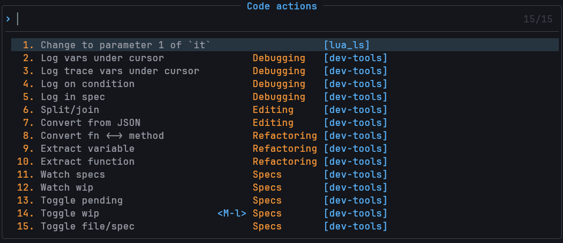
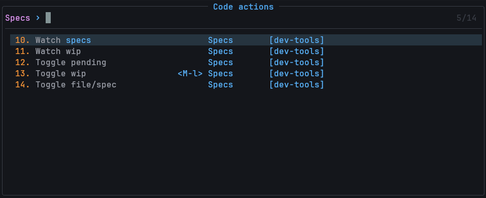
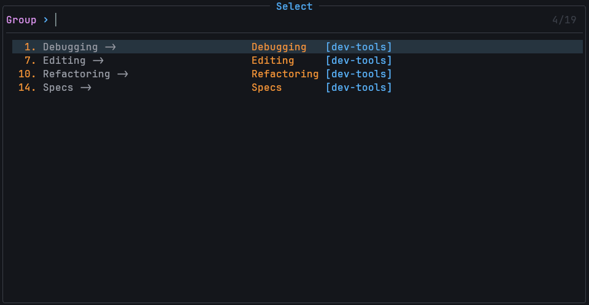

# dev-tools.nvim [](https://github.com/yarospace/dev-tools.nvim/actions/workflows/tests.yml)

A Neovim plugin that provides in-process LSP server, a community library and a convenient interface for customization and enhancement of your Neovim with custom code actions.

## Features

- 🚀 In-process LSP server for code actions
- 🧩 Simple, intuitive interface and helpers for managing and creating code actions
- 🔍 Enhanced code actions picker with live filtering, grouping, keymaps and extra info
- 📚 Community-driven library of useful code actions

## Installation and setup

With [lazy.nvim](https://github.com/folke/lazy.nvim), you are only required to set the `filetypes.include` option, the rest is optional.

You may want to tweak a few options, notably global keymaps and choose which actions to include/exclude, to keep the picker clean and fast.

```lua
{
  'yarospace/dev-tools.nvim',
  dependencies = { 
    "nvim-treesitter/nvim-treesitter" -- code manipulation in buffer, required
    {
      "folke/snacks.nvim", -- optional
      opts = {
        picker = { enabled = true }, -- actions picker
        terminal = { enabled = true }, -- terminal for running spec actions
      },
    },
    {
      "ThePrimeagen/refactoring.nvim", -- refactoring library, optional
      dependencies = { "nvim-lua/plenary.nvim" },
    },
  },

  opts = {
    ---@type Action[]|fun():Action[]
    actions = {},

    filetypes = { -- filetypes for which to attach the LSP
      include = {}, -- {} to include all
      exclude = {},
    },
  }
```

For other package managers, you may need to include dependencies and call `require('dev-tools').setup({ ... })` in your config.

<details><summary>Minimal Config</summary>

<!-- config:start -->
```lua
{
  'yarospace/dev-tools.nvim',
  dependencies = { 
    "nvim-treesitter/nvim-treesitter" -- code manipulation in buffer, required
    {
      "folke/snacks.nvim", -- optional
      opts = {
        picker = { enabled = true }, -- actions picker
        terminal = { enabled = true }, -- terminal for running spec actions
      },
    },
    {
      "ThePrimeagen/refactoring.nvim", -- refactoring library, optional
      dependencies = { "nvim-lua/plenary.nvim" },
    },
  },

  opts = {
    ---@type Action[]|fun():Action[]
    actions = {},

    filetypes = { -- filetypes for which to attach the LSP
      include = {}, -- {} to include all
      exclude = {},
    },

    builtin_actions = {
      include = {}, -- filetype/group/name of actions to include or {} to include all
      exclude = {}, -- filetype/group/name of actions to exclude or true to exclude all
    },

    action_opts = { -- override options for actions
      {
        group = "Debugging",
        name = "Log vars under cursor",
        opts = {
          keymap = nil, -- action keymap, e.g. 
              -- { 
              --   global = "<leader>dl" | { "<leader>dl", mode = { "n", "x" } }, 
              --   picker = "<M-l>",
              --   hide = true,  -- hide the action from the picker
              -- }
        },
      },
    },

    ui = {
      override = true, -- override vim.ui.select, requires `snacks.nvim` to be included in dependencies or installed separately
      group_actions = true, -- group actions by group name
    },
  }
}
```
<!-- config:end -->

</details>

<details><summary>Full Config</summary>

<!-- config:start -->
```lua
local M = {
  ---@type Action[]|fun():Action[]
  actions = {},

  filetypes = { -- filetypes for which to attach the LSP
    include = {}, -- {} to include all, except for special buftypes, e.g. nofile|help|terminal|prompt
    exclude = {},
  },

  builtin_actions = {
    include = {}, -- filetype/group/name of actions to include or {} to include all
    exclude = {}, -- filetype/group/name of actions to exclude or "true" to exclude all
  },

  action_opts = { -- override default options for actions
    {
      group = "Debugging",
      name = "Log vars under cursor",
      opts = {
        logger = nil, -- function to log debug info
        keymap = nil, -- action keymap, e.g. 
            -- { 
            --   global = "<leader>dl" | { "<leader>dl", mode = { "n", "x" } }, 
            --   picker = "<M-l>",
            --   hide = true,  -- hide the action from the picker
            -- }
        },
      },
    },
    {
      group = "Specs",
      name = "Watch specs",
      opts = {
        tree_cmd = nil, -- command to run the file tree
        test_cmd = nil, -- command to run tests
        test_tag = nil, -- command to add tags to the test command
        terminal_cmd = nil, -- function to run the terminal
      },
    },
  },

  ui = {
    override = true, -- override vim.ui.select, requires `snacks.nvim` to be included in dependencies or installed separately
    group_actions = false, -- group actions by group or LSP group
    keymaps = { filter = "<C-b>", open_group = "<C-l>", close_group = "<C-h>" },
  },

  debug = false, -- extra debug info
  cache = true, -- cache the actions on start
}
```
<!-- config:end -->

</details>

> [!NOTE]
> Dev-tools picker uses Snacks.nvim picker module, which should be included as a dependency or installed separately.

## Usage

- Code actions are accessible via the default LSP keymaps, e.g. `gra`, `<leader>ca`, `<leader>la`, etc. 
- Last action is dot-repeatable.
- You can add a global or a picker local keymap by specifying it in the `keymap` table of the `action_opts`.

Dev-tools actions picker is an enhanced version of the default picker, which provides extra info about the actions, live filtering and actions keymaps.



- `<C-b>` will cycle through categories filter



- If `opts.ui.group_actions` is set to `true`, the actions will be grouped by group name.  
Use `<C-l>` to open the group and `<C-h>` to close.



## Adding code actions

- Custom actions can be added to the `opts.actions` table in your configuration  
or registered via `require('dev-tools').register_action({})`

```lua
---@class Action
---@field name string - name of the action
---@field group string|nil - group of the action
---@field condition string|nil|fun(action: ActionCtx): boolean - function or pattern to match against buffer name
---@field filetype string[]|nil - filetype to limit the action to
---@field fn fun(action: ActionCtx) - function to execute the action

---@class ActionCtx: Action
---@field ctx Ctx - context of the action

---@class Ctx
---@field buf number - buffer number
---@field win number - window number
---@field row number - current line number
---@field col number - current column number
---@field line string - current line
---@field word string - word under cursor
---@field ts_node TSNode|nil - current TS node
---@field ts_type string|nil - type of the current TS node
---@field ts_range table<number, number, number, number>|nil - range of the current TS node
---@field bufname string - full path to file in buffer
---@field root string - root directory of the file
---@field filetype string - filetype
---@field range Range|nil - range of the current selection
---@field edit Edit - edititng functions

---@class Range
---@field start {line: number, character: number} - start position of the range
---@field end {line: number, character: number} - end position of the range
---@field rc table<number, number, number, number> - row/col format

opts = {
  ---@type Action[]|fun():Action[]
  actions = {
    {
      name = "Extract variable",
      filetype = { "lua" },
      fn = function(action)
        local ctx = action.ctx

        vim.ui.input({ prompt = "Variable name:", default = "" }, function(var_name)
          if not var_name then return end

          local var_body = ("local %s = %s"):format(var_name, ctx.edit:get_range()[1])

          ctx.edit:set_range { var_name }
          ctx.edit:set_lines({ var_body }, ctx.range.rc[1], ctx.range.rc[1])

          ctx.edit:indent(ctx.range.rc[1] - 1, ctx.range.rc[3] + 1)
          ctx.edit:set_cursor(ctx.range.rc[1] + 2, ctx.range.rc[2] + 1)
        end)
      end,
    },
  }
}
```

There are several helper functions to make it easier to create actions:

```lua
---@class Edit: Ctx
---@field get_lines fun(self: Edit, l_start?: number, l_end?: number): string[] - get lines in the buffer
---@field set_lines fun(self: Edit, lines: string[], l_start?: number, l_end?: number) - set lines in the buffer
---@field get_range fun(self: Edit, ls?: number, cs?: number, le?: number, ce?: number): string[] - get lines in the range of the buffer
---@field set_range fun(self: Edit, lines: string[], ls?: number, cs?: number, le?: number, ce?: number) - set lines in range of the buffer
---@field get_node fun(self: Edit, types: string|string[], node?: TSNode|nil, predicate?: fun(node: TSNode): boolean| nil): TSNode|nil, table <number, number, number, number>|nil - traverses up the tree to find the first TS node matching specified type/s
---@field get_previous_node fun(self: Edit, node: TSNode, allow_switch_parents?: boolean, allow_previous_parent?: boolean): TSNode|nil - get previous node with same parent
---@field get_node_text fun(self: Edit, node?: TSNode): string|nil - get the text of the node
---@field indent fun(self: Edit, l_start?: number, l_end?: number) - indent range in the buffer
---@field set_cursor fun(self: Edit, row?: number, col?: number) - set the cursor in the buffer
---@field write fun() - write the buffer
```

> [!NOTE]
> Dev-tools actions API is slightly different from `null-ls/none-ls` API.

I may implement 100% compatibility if there is a demand for it.  Let me know.

## Contributing

This project is originally thought out as community driven. 

The goal is to provide a simple and intuitive interface for creating and managing code actions, as well as a collection of useful code actions that can be used out of the box.
Your contributions are highly desired and appreciated!

All actions are stored in `dev-tools.nvim/lua/dev-tools/actions/`.  
Actions specific to a language can be put under the relevant subdirectory.

```lua
---@class Actions
---@field group string - group of actions
---@field filetype string[]|nil - filetype to limit the actions group to
---@field actions Action[]|fun(): Action[] - list oe actions

---@class Action
---@field name string - name of the action
---@field group string|nil - group of the action
---@field condition string|nil|fun(action: ActionCtx): boolean - function or pattern to match against buffer name
---@field filetype string[]|nil - filetype to limit the action to
---@field fn fun(action: ActionCtx) - function to execute the action

---@type Actions
return {
  group = "Refactoring",
  filetype = { "lua" },
  actions = {
    {
      name = "Extract variable",
      condition = "_spec",
      fn = function(action)
        ---
      end,
    },
    {
      name = "Extract function",
      condition = function(action) return action.ctx.root:match("project") end,
      fn = function(action)
        --
      end,
    },
  },
}
```

## Available actions

### Lua

#### Refactoring

- [x] Extract variable
- [x] Extract function

#### Editing

- [x] Split/join function/table/conditional
- [x] Convert JSON to Lua table

#### Specs

- [x] Run/watch all specs
- [x] Run/watch current spec

#### Specs

- [x] Switch between code and spec files
- [x] Toggle pending
- [x] Toggle #wip tag

#### Debugging

- [x] Log variable under cursor
- [x] Log with trace
- [x] Log on condition
- [x] Log in spec
- [x] Clear logs

### Go, Javascript, Lua, Python, Typescript, C/C++, Java, PHP, Ruby, C#

#### Refactoring [ThePrimeagen/refactoring.nvim](https://github.com/ThePrimeagen/refactoring.nvim)

The module should be included as a dependency or installed separately, and will be automatically detected.

Actions are available only for visually selected code.

- [x] Extract function
- [x] Inline function
- [x] Extract variable
- [x] Inline variable

## License

MIT
